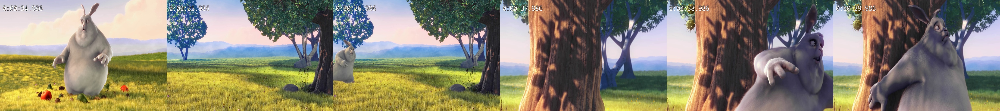
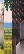
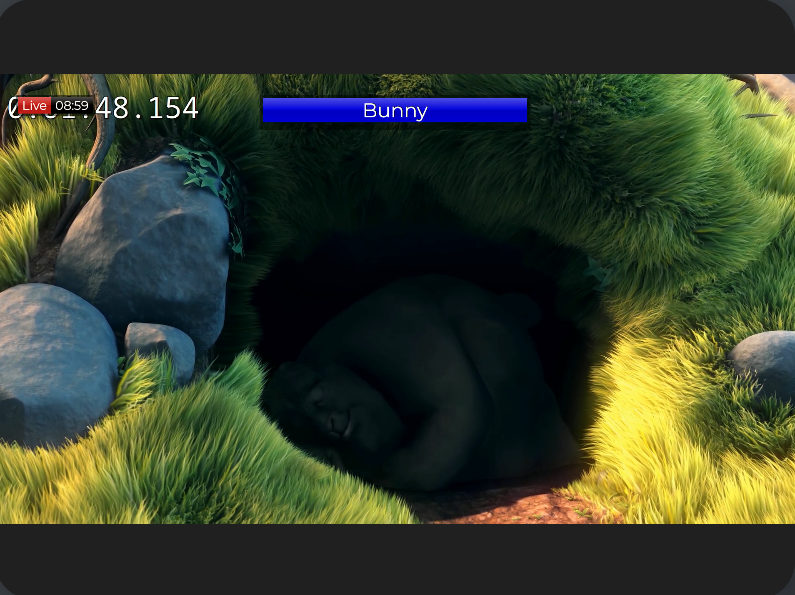

# Recording application with GStreamer

This is a simple application that uses GStreamer to record video from a webcam and save it to a file.
The recording consists of a hls playlist file and a series of video chunks. The playlist file is updated with each new chunk of video.

Additionally, it records the tooltip images for each chunk of video and creates a sprite image from each chunk of video.

It is possible to take a still image from the webcam and save it to a file.

For the linking between the source (webcam) with the recoding and still pipelines, an `unixfd` element is used.

Also, a preview pipeline is available to display the video as a webrtc stream.
This preview can be configured to display the video with an overlay. 

## Usage
To control the application a REST interface is available. The application can be started and stopped, the recording can be started and stopped, and a still image can be taken.
[Taskfile](https://taskfile.dev/) is used to build and run the application. 
Create an .env file with .env-template as a template and fill in the values.

The application assumes that the videosource is available on /dev/video10. In order to simulate a webcam, the v4l2loopback kernel module is used.
The necessary files are are located in tools/endless-recording.

| Command                                    | Description                                                                |
|--------------------------------------------|----------------------------------------------------------------------------|
| `task endless-stream:getfull-fhd`          | Downloads the full blender movie BigBunny and stores it in /temp/video.mp4 |
| `task endless-stream:install-v4l2loopback` | Installs a virtual v4l2 device on /dev/video10 (temporary)                 |
| `task endless-stream:run`                  | Starts playing the video to /dev/video10 in an endless loop                |

To build the application run the following command:

| Command                | Description                                      |
|------------------------|--------------------------------------------------|
| `task build-app `      | Builds the application                           |
| `task run-app `        | Starts the application                           |
| `task run-app-overlay` | Starts the application with an overlay on webrtc |

The rest interface is available at `http://localhost:4000` with the following endpoints:

* `POST /recording/start` - starts the recording
* `POST /recording/stop` - stops the recording
* `POST /start` - starts the input pipeline
* `POST /stop` - stops the input pipeline
* `POST /still` - takes a snapshot from the webcam and saves it to a file

| Command                        | Description                                 |
|--------------------------------|---------------------------------------------|
| `task command:start `          | Starts the videosource and webrtc streaming |
| `task command:stop`            | Stops the videosource and webrtc streaming  |
| `task command:start-recording` | Starts the video recording                  |
| `task command:stop-recording`  | Stops the video recording                   |
| `task command:still`           | Takes a still                               |

## Configuration

The configuration is done in the `config.toml` file. The following parameters are available:

* `source_pipe` - the pipeline that reads from the webcam
* `recording_pipe` - the pipeline that writes to the file
* `still_pipe` - the pipeline that reads from the webcam and writes to a file
* `preview_pipeline` - the pipeline that reads from the webcam and displays the video
* `preview_pipeline_overlay` - the pipeline that reads from the webcam and displays the video with an overlay
* `chunk_size` - the size of the video chunks in seconds
* `output_dir` - the directory where the video files are saved
* `chunkprefix` - the prefix of the video files
 
## Dependencies
Build on Manjaro Linux with the following dependencies:
* GStreamer
* Gstreamer rust plugins [gst-plugins-rs](https://gitlab.freedesktop.org/gstreamer/gst-plugins-rs)
* OpenCV
* NVIDIA drivers

## Output

The output of the application is a series of video chunks and a playlist file. The playlist file is updated with each new chunk of video.

| Description   | Output                                                      |
|---------------|-------------------------------------------------------------|
| video chunks  | < not shown here >                                          |
| playlist file |  |
| tooltip file  |  |
| sprite file   |     |
| the vtt file  | [vtt](./doc/images/20241211-083017-thumbnails.vtt)          |

The sprite file takes 4 pixels in the middle for each second of video. The sprite file is used to give a rough overview of the video.
The vtt file created can be used by the http://plyr.io player to display the thumbnails during the playback.
On WebRTC preview the video is displayed with an overlay as shown below:

## GStreamer pipelines
The following is the graphical representation of the GStreamer pipelines used in the application.
They are created with the `dot` tool from the `graphviz` package. In order to create the dot files the `GST_DEBUG_DUMP_DOT_DIR` environment variable has to be set.

| Description   | Output                                                    |
|---------------|-----------------------------------------------------------|
| videosource   | [pipeline-source](./doc/images/pipeline-source.png)       |
| videoreording | [pipeline-recording](./doc/images/pipeline-recording.png) |
| videopreview  | [pipeline-preview](./doc/images/pipeline-preview.png)     |
| videostill    | [pipeline-still](./doc/images/pipeline-still.png)         |

## GStreamer elements used
* To share the video frames [unixfd](https://gstreamer.freedesktop.org/documentation/unixfd/unixfd.html?gi-language=c) is used.
This element does not copy the video frames but shares the memory between the pipelines. This sharing is done by passing a file descriptor between the pipelines. 
For this to happen the signal is propagated to the videosource element.

* For the webrtc preview the [webrtcsink](https://gstreamer.freedesktop.org/documentation/rswebrtc/webrtcsink.html?gi-language=rust) is used. This element is used to stream the video to a webrtc server.
* For the recording the [hlssink3](https://gstreamer.freedesktop.org/documentation/hlssink3/hlssink3.html?gi-language=rust#hlssink3) element is used. This element is used to create a hls playlist file and a series of video chunks.
* For the overlay the [wpesrc](https://gstreamer.freedesktop.org/documentation/wpe/wpesrc.html?gi-language=rust) is used. This element can read from a headless browser and display the video with an overlay.
The actual overlay server was implemented by https://github.com/moschopsuk/Roses-2015-CasparCG-Graphics with some adaption from [here](https://github.com/Igalia/wpe-graphics-overlays/tree/1e23f781adef05d6d2f291d9bb67c28f9bb9b2f1).
It gives a nice http frontend to dynamically create overlays.

## Issues during the implementation
* The hlssink3 element only creates playlist entries with fully created chunks. So if the chunk size is 6 seconds, the playlist file is updated every 6 seconds. 
If a recording is stopped before the chunk is fully created, the playlist file is not updated. So you might have a chunk that is not listed in the playlist file.

* The wpesrc elements had troubles creating the overlay directly on the GPU (Nvidia). So the environment variable LIBGL_ALWAYS_SOFTWARE had to be used to create the overlay on the CPU.
The root cause seems to be the library from Igalia https://github.com/Igalia/WPEBackend-offscreen-nvidia which would solve this issue.
The actual mixing of the video and the overlay is done with the `glvideomixer` element. Only this element was able to make the overlay transparent.

* The unixfdsrc element had issues getting a file descriptor once the stream has been uploaded to the GPU via glupload.

* The webrtcsink element was used in this example with webserver enabled and the embedded signalling server. Inside the docker container the signalling server lost constantly the connection.
So in a real application, a separate signalling server should be used.
